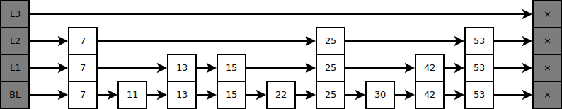

# Lock-free Skip List

\doublespacing

\abstract{
  Lorem ipsum dolor sit amet, consectetur adipisicing elit, sed do eiusmod tempor incididunt ut labore et dolore magna aliqua. Ut enim ad minim veniam, quis nostrud exercitation ullamco laboris nisi ut aliquip ex ea commodo consequat. Duis aute irure dolor in reprehenderit in voluptate velit esse cillum dolore eu fugiat nulla pariatur. Excepteur sint occaecat cupidatat non proident, sunt in culpa qui officia deserunt mollit anim id est laborum.
}

<!-- \newpage -->

## Introduction

A Skip List is a data structure designed to allow for fast searching like a
B-Tree, but also allow for fine-gained concurrency like a Linked List allows.
We implemented a Lock-free and fine-gained Skip-List, showing that we can get
comparable performance between our Implementation and Java's
$java.util.ConcurrentSkipListSet$. Lock-free means that we use atomic actions
instead of locks (or semaphores), we expect that this will give us a performance
improvement as we will not have to perform lock arbitration. Fine-gained means
that a small subset of the list will block other modifications, instead of the
entire list blocking.

| Operation        | Linked List      | Binary Tree      | Skip List           |
|------------------|------------------|------------------|---------------------|
| Access           | $\Theta(n)$      | $\Theta(log(n))$ | $\Theta(log(n))$    |
| Search           | $\Theta(n)$      | $\Theta(log(n))$ | $\Theta(log(n))$    |
| Insert           | $\Theta(1)$      | $\Theta(log(n))$ | $\Theta(log(n))$    |
| Remove           | $\Theta(1)$      | $\Theta(log(n))$ | $\Theta(log(n))$    |
| Space Complexity | $\Theta(n)$      | $\Theta(n)$      | $\Theta(n\:log(n))$ |
Table: Bit-O of Linked List, Binary Tree, and Skip List

In Table 1 we compare the various speeds of Linked Lists, Binary Trees, and Skip
Lists. Linked Lists are slow to access and search as we have to traverse each
node in the list to get to the next. However, it is very fast to insert and
remove a given node as we can get right to it, and swap the pointers around.
Binary Trees are all moderately fast, $\Theta(log(n))$, and a good in between in
performance of linked list and arrays. However, the entire tree must be blocked
off during an insert, delete, or modification. When we make a change to node
$n$, $n$ has a fairly good chance of moving to a different place in the list.
This move forces the rest of the list to rebalance, and would force another
process to start over from the new tree. A Skip List solves both of these issues
by making modifications to the list like a linked list, but at the same time
having a layered structure internally. From this, it is moderately fast and
allows for fine-gained locking.

## Implementation

A skip-list is a sorted linked list with several layers that enable searches to skip forward various distances in the list, as shown below:

We implemented the probabilistic skip-list where the insertion of an element has some probability _p_ that it will be inserted in the current level vs the next one. This allows for a probabalistically even distribution of links such that we can obtain O(_log(n)_) insertion time.

## Something else

Lorem ipsum dolor sit amet, consectetur adipisicing elit, sed do eiusmod tempor
incididunt ut labore et dolore magna aliqua. Ut enim ad minim veniam, quis
nostrud exercitation ullamco laboris nisi ut aliquip ex ea commodo consequat.
Duis aute irure dolor in reprehenderit in voluptate velit esse cillum dolore eu
fugiat nulla pariatur. Excepteur sint occaecat cupidatat non proident, sunt in
culpa qui officia deserunt mollit anim id est laborum.

Lorem ipsum dolor sit amet, consectetur adipisicing elit, sed do eiusmod tempor
incididunt ut labore et dolore magna aliqua. Ut enim ad minim veniam, quis
nostrud exercitation ullamco laboris nisi ut aliquip ex ea commodo consequat.
Duis aute irure dolor in reprehenderit in voluptate velit esse cillum dolore eu
fugiat nulla pariatur. Excepteur sint occaecat cupidatat non proident, sunt in
culpa qui officia deserunt mollit anim id est laborum.

Lorem ipsum dolor sit amet, consectetur adipisicing elit, sed do eiusmod tempor
incididunt ut labore et dolore magna aliqua. Ut enim ad minim veniam, quis
nostrud exercitation ullamco laboris nisi ut aliquip ex ea commodo consequat.
Duis aute irure dolor in reprehenderit in voluptate velit esse cillum dolore eu
fugiat nulla pariatur. Excepteur sint occaecat cupidatat non proident, sunt in
culpa qui officia deserunt mollit anim id est laborum.
